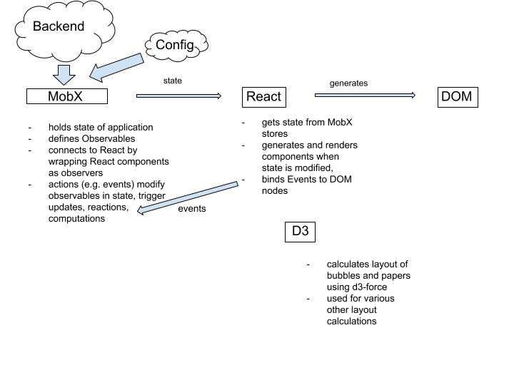

# Headstart with React and MobX Proof-of-Concept

This is the start of a new implementation of headstart using the React and MobX libraries to
to improve software sustainability, event and state management.

The project is still in an very early phase and will change quickly.

## Getting started

Since this app was bootstrapped with [Create React App](https://github.com/facebookincubator/create-react-app)
you will need to have `node` installed with a version `>=6`.
To install the necessary dependencies, issue the command `npm install` after cloning the repo.

To start a development server, just type `npm start`. A browser window will open at `http://localhost:3000`
and you can play around with the app.

You can run the test suite by running `npm test`.

This project was bootstrapped with [Create React App](https://github.com/facebookincubator/create-react-app).

## Project structure

Main Entry point to the execution is the `src/index.js`
file.

#### `src/components`

All React components. Main entry point is found in `src/components/App.js` component.

#### `src/eventhandlers`

Eventhandling functions, named after the general area they are bound to.

#### `src/helpers`

Helper functions, e.g. the force simulation that calculates the layout.

#### `src/models`

MobX stores and their members, e.g. the UIStore, various classes modeling
state of Bubbles/Papers.

#### `src/static`

Static assets and mock data from the backend.

#### `src/stylesheets`

Sass stylesheets. Have to be recompiled manually for now and have
to end up in `src/stylesheets/main.css`.

#### `src/__tests__`

Files to be picked up by the testing suite. Have to have the
file extension *.test.js. Currently not passing.